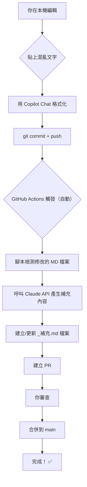
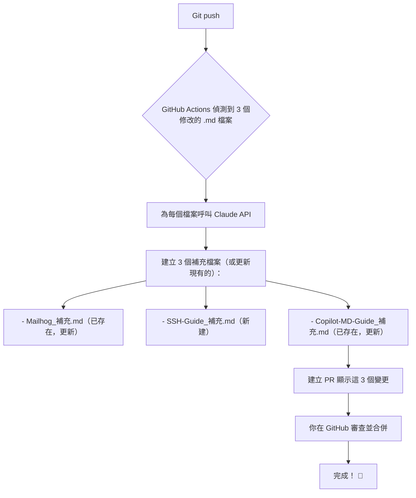

# GitHub Actions 自動補充檔案部署指南

## 概述

這個系統會在你 `push` 到 GitHub 後自動：

1. 檢測新增/修改的 MD 檔案
2. 調用 Claude AI 生成補充內容
3. 建立或更新 `{檔案名稱}_補充.md` 檔案
4. 建立 PR 供你審查

---

## 完整工作流程



---

## 前置條件

### 1️⃣ Anthropic API Key（必需）

取得 API Key：

- 造訪 https://console.anthropic.com/
- 登入帳戶（無帳戶則註冊）
- 點擊 **API Keys** → **Create Key**
- 複製產生的 key（只會顯示一次！）

### 2️⃣ GitHub 帳戶權限（已有🎉）

你已經有了，因為這是你的儲存庫。

---

## 設定步驟

### 步驟 1️⃣ : 新增 API Key 到 GitHub Secrets

GitHub Secrets 是安全儲存敏感資訊的地方（API Key 不會暴露在代碼中）。

**在 GitHub 網頁上操作：**

1. 打開你的儲存庫首頁
2. 點擊 **Settings**（右上角）
3. 左側選單 → **Secrets and variables** → **Actions**
4. 點選 **New repository secret**
5. 名稱：`ANTHROPIC_API_KEY`
6. 值：貼上你從 `console.anthropic.com` 複製的 key
7. 點 **Add secret**

**驗證：**

```
你應該可以看到列表中有 "ANTHROPIC_API_KEY"（值被隱藏）
```

---

### 步驟 2️⃣ : 確認工作流程檔案已在正確位置

你的儲存庫現在應該有這些檔案：

```
ZonWiki/
├── .github/
│   ├── workflows/
│   │   └── md-supplement.yml ← GitHub Actions 工作流程
│   └── scripts/
│       └── generate-supplement.js ← 處理腳本
├── .gitignore ← 已設定
└── Programming/
    ├── Mailhog.md
    ├── SSH-Guide.md
    ├── Copilot-MD-Guide.md
    └── ...
```

---

### 步驟 3️⃣ : 提交設定檔到 GitHub

```powershell
cd d:\Repos\SideProjects\ZonWiki

# 新增新的工作流程檔案
git add .github/

# 提交
git commit -m "ci: add auto MD supplement generator"

# 推送
git push origin main

# 驗證
# 訪問 GitHub → Actions 標籤頁，應該可以看到工作流程已激活
```

---

## 使用方式

### 正常工作流程（日常操作）

```powershell
# 1. 在 VS Code 編輯 Mailhog.md
# 2. 使用 Copilot Chat 格式化

# 3. 建立新檔案 SSH-Guide.md（或修改已有檔案）

# 4. 提交並推送
git add Programming/*.md
git commit -m "docs: update markdown files"
git push origin main

# 5. 不要做其他事情 - GitHub Actions 會自動：
# - 建立 SSH-Guide_補充.md
# - 檢查並更新 Mailhog_補充.md
# - 建立 PR
```

### 查看自動產生的 PR

1. 造訪 GitHub 儲存庫首頁
2. 點選 **Pull requests** 標籤
3. 檢視 GitHub Actions 建立的 PR
4. 審查補充內容
5. 如果滿意，點 **Merge pull request**
6. 補充檔案自動合併到 `main`

---

## 自動產生補充檔案的目錄

| 原始檔案            | 補充檔案              | 包含內容         |
| :------------------ | :-------------------- | :--------------- |
| `Mailhog.md`        | `Mailhog_補充.md`     | ✅ 自動建立/更新 |
| `SSH-Guide.md`      | `SSH-Guide_補充.md`   | ✅ 自動建立/更新 |
| `Copilot-MD-Guide.md` | `Copilot-MD-Guide_補充.md` | ✅ 自動建立/更新 |
| 新增的任一 `.md`    | `{filename}_補充.md`  | ✅ 自動建立      |

---

## 故障排查

### ❌ 問題 1：GitHub Actions 沒有執行

**檢查清單：**

1. ✓ API Key 已新增到 Secrets？
   - GitHub → Settings → Secrets → 檢視 `ANTHROPIC_API_KEY`
2. ✓ 工作流程檔案在正確位置？
   - `.github/workflows/md-supplement.yml`
3. ✓ 修改的是 `.md` 檔案嗎？
   - 工作流程只監聽 `Programming/**/*.md`
4. ✓ 推送到了 `main` 分支？
   - 工作流程設定的是 `main` 分支

**解決：**

```powershell
# 檢查 Actions 標籤頁的日誌
造訪 GitHub → Actions → 檢視最近一次執行的日誌
```

---

### ❌ 問題 2：PR 建立失敗

**可能原因：**

- API Key 無效或已過期
- API 請求超時
- 檔案權限問題

**解決：**

1. 檢查 API Key 是否正確（重新在 Secrets 中驗證）
2. 查看 Actions 日誌以了解詳細錯誤
3. 確保 Claude API 配額充足

---

### ❌ 問題 3：產生的補充內容不是我想要的

**解決方式：**

1. 手動編輯 `_補充.md` 檔案
2. 直接 `push` 到 `main`（不會被覆蓋，腳本會合併）
3. 或修改 `generate-supplement.js` 中的 `prompt`

---

## 進階設定

### 修改補充內容的生成規則

編輯 `.github/scripts/generate-supplement.js` 中的 `generateSupplement` 函數的 `prompt`：

```javascript
const prompt = `你是個 Markdown 檔案編輯助手。
…
請產生包含以下內容的補充檔案：
1. 【你的規則 1】
2. 【你的規則 2】
…
`;
```

### 修改工作流程觸發條件

編輯 `.github/workflows/md-supplement.yml`：

```yaml
on:
  push:
    branches:
      - main # 修改為你的分支名
    paths:
      - 'Programming/**/*.md' # 修改監聽的目錄
```

---

## 成本考慮

### API 調用成本

- **每個檔案**：~1-2k tokens（通常 $0.01-0.02）
- **範例**：修改 5 個檔案 → ~$0.05-0.10
- **月度估計**：~$1-5（根據修改頻率）

### 降低成本的方式

1. 批次 `push`（一次 `push` 多個檔案）
2. 避免頻繁小修改
3. 或降低生成內容的詳細程度

---

## 完整範例場景

假設你：

1. 修改了 `Mailhog.md`
2. 新增了 `SSH-Guide.md`
3. 修改了 `Copilot-MD-Guide.md`

**會發生什麼事：**



---

## 下一步

你現在有了：

✅ VS Code Copilot Chat 格式化流程
✅ GitHub Actions 自動補充檔案系統
✅ SSH 認證已設定
✅ `.gitignore` 已設定（僅追蹤 md/txt/圖表片）

**準備好了嗎？**

1. 設定 API Key 到 GitHub Secrets
2. `git push .github/` 目錄
3. 修改一個 `.md` 檔並 `push`
4. 在 GitHub Actions 中查看執行結果
5. 審查並合併自動產生的 PR

有問題可以參考本指南的故障排查部分！
