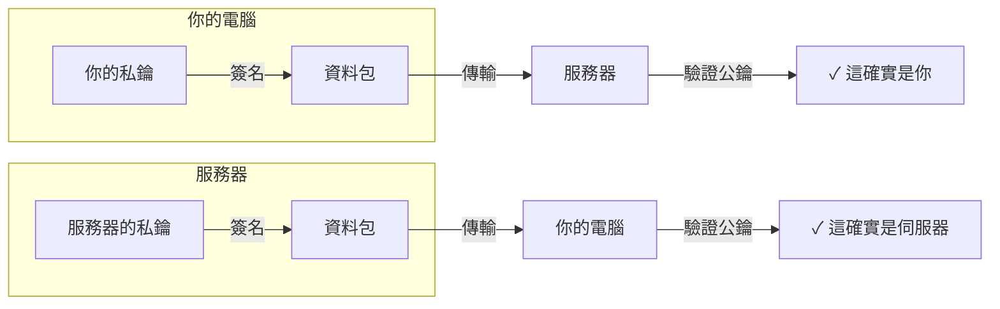

# SSH 完整學習指南

## 什麼是 SSH？

**SSH (Secure Shell)** 是一種**網路安全協議**，用於在不安全的網路上安全地執行遠端操作。

### 核心特點

| 特點       | 說明                                   |
| :--------- | :------------------------------------- |
| **加密通訊** | 所有資料都被加密，即使在公網上傳輸也安全 |
| **身分認證** | 確保你是真正的使用者，對方才是真正的伺服器 |
| **無需密碼** | 用密鑰對替代密碼，更安全               |
| **遠端指令執行** | 可以安全地在遠端伺服器上執行指令       |

---

## SSH 的工作原理（淺顯解釋）

```mermaid
graph LR
    A[你的電腦 (客戶端)] -->|1. "哈囉，我是 User"| B[服務器 (SSH服務)]
    A -->|2. "我發送這個公鑰"| B
    B -->|3. 服務器驗證公鑰是否在信任清單中|
    B -->|4. "驗證通過！建立安全通道"| A
    A <-->|5. 所有後續通訊都加密| B
```

---

## 密鑰對概念

### 公鑰 vs 私鑰

|            | 公鑰                 | 私鑰                     |
| :--------- | :------------------- | :----------------------- |
| **分享性** | 可以公開分享         | 必須保密（像密碼一樣）   |
| **儲存位置** | 放在伺服器上         | 儲存在本機電腦           |
| **用途**   | 用來驗證你的身分     | 用來證明自己身分         |
| **加密/解密** | 也可以用來加密資料   | 用來解密資料             |

**類比：** 公鑰像你的"郵箱地址"（可以告訴任何人），私鑰像"郵箱鑰匙"（只有你有）。

### 工作流程



---

## Windows PowerShell 上的 SSH 設定詳解

### 步驟 1：產生 SSH 密鑰對

```powershell
# 產生 ED25519 密鑰（現代、安全）
ssh-keygen -t ed25519 -C "your_email@example.com"

# 或使用更相容的 RSA 密鑰
ssh-keygen -t rsa -b 4096 -C "your_email@example.com"
```

**參數說明：**

- `-t ed25519` : 密鑰類型（ED25519 更現代更快，RSA 更相容）
- `-C "comment"` : 註解（通常是郵箱）
- `-b 4096` : RSA 金鑰長度（4096 位元更安全）

**過程中的提示：**

```
Enter file in which to save the key (~/.ssh/id_ed25519):
# 直接 Enter，使用預設位置

Enter passphrase (empty for no passphrase):
# 可以輸入密碼（二次認證）或 Enter 跳過
# 推薦：第一次學習直接 Enter，後續可以加密碼

Enter same passphrase again:
# 確認密碼
```

**產生的檔案：**

```
C:\Users\YourUsername\.ssh\
├── id_ed25519 ← 私鑰（保密！）
└── id_ed25519.pub ← 公鑰（可分享）
```

### 步驟 2：啟動 SSH Agent

SSH Agent 是一個後台程序，可協助你管理私鑰，避免每次都輸入密碼。

```powershell
# 1. 啟動 SSH Agent（Windows）
Get-Service ssh-agent | Set-Service -StartupType Automatic
Start-Service ssh-agent

# 2. 驗證
Get-Service ssh-agent

# 輸出範例：
# Status Name DisplayName
# ------ ---- -----------
# Running ssh-agent OpenSSH Authentication Agent
```

### 步驟 3：新增私鑰到 Agent

```powershell
# 新增私鑰
ssh-add $env:USERPROFILE\.ssh\id_ed25519

# 驗證已新增
ssh-add -l

# 輸出範例：
# 256 SHA256:abc123... user@example.com (ED25519)
```

### 步驟 4：複製公鑰到 GitHub

```powershell
type $env:USERPROFILE\.ssh\id_ed25519.pub | clip
```

然後：

- 登入 GitHub
- 點擊 **Settings** → **SSH and GPG keys** → **New SSH key**
- **Title**: 取個名字（如"My PC"）
- **Key type**: 選擇 **Authentication Key**
- **Key**: 貼上你複製的公鑰
- 點 **Add SSH key**

---

## 如何使用 SSH 連接 GitHub

### 測試 SSH 連接

```powershell
ssh -T git@github.com

# 第一次會問：Are you sure you want to continue connecting? (yes/no/[fingerprint])
# 輸入：yes

# 成功輸出：
# Hi YourUsername! You've successfully authenticated, but GitHub does not provide shell access.
```

### 複製儲存庫（使用 SSH）

```powershell
# 使用 SSH URL 複製
git clone git@github.com:YourUsername/ZonWiki.git

# 不需要輸入使用者名稱和密碼！
```

### 已有儲存庫，切換到 SSH

```powershell
cd path/to/ZonWiki

# 查看當前的 remote
git remote -v

# 改為 SSH
git remote set-url origin git@github.com:YourUsername/ZonWiki.git

# 驗證
git remote -v
```

---

## SSH 常見應用場景

### 場景 1：Git 操作（你的狀況 ✅）

```powershell
# 複製、推送、拉取都用 SSH
git clone git@github.com:user/repo.git
git push origin main
git pull origin main
```

**優點：** 無需每次輸入密碼，腳本自動化最方便。

---

### 場景 2：遠端服務器登入

```powershell
# SSH 登入遠端服務器
ssh user@example.com

# 直接在遠端服務器執行命令
ssh user@example.com "ls -la /home"

# 保持連接
ssh -i ~/.ssh/id_rsa user@example.com
```

---

### 場景 3：檔案傳輸（SCP）

```powershell
# 從本機複製檔案到遠端
scp file.txt user@example.com:/home/user/

# 從遠端複製到本機
scp user@example.com:/home/user/file.txt ./

# 整個目錄
scp -r ./folder user@example.com:/home/user/
```

---

### 場景 4：SSH 頻道（連接埠轉發）

```powershell
# 透過遠端服務器訪問內部數據庫
# 本機 3306 → 遠端 MySQL 3306
ssh -L 3306:localhost:3306 user@example.com

# 現在可以用 localhost:3306 存取遠端資料庫
mysql -h localhost -u user -p
```

---

### 場景 5：自動化腳本

```bash
#!/bin/bash
# 自動備份腳本
ssh -i ~/.ssh/id_rsa backup@server.com << 'EOF'
 tar -czf /backups/backup-$(date +%Y%m%d).tar.gz /data/
 echo "Backup completed"
EOF
```

---

### 場景 6：多個 SSH 密鑰（不同身分）

```powershell
# GitHub 私人帳戶
# ~/.ssh/id_ed25519 (GitHub Personal)

# GitHub 工作帳戶
# ~/.ssh/id_work (GitHub Work)

# 設定 SSH config 檔決定用哪個密鑰
# 檔案位置：~/.ssh/config
```

**`~/.ssh/config` 範例：**

```ini
# GitHub 個人帳戶
Host github-personal
  HostName github.com
  User git
  IdentityFile ~/.ssh/id_ed25519

# GitHub 工作帳戶
Host github-work
  HostName github.com
  User git
  IdentityFile ~/.ssh/id_work

# 使用範例
# git clone git@github-personal:user/personal-repo.git
```
