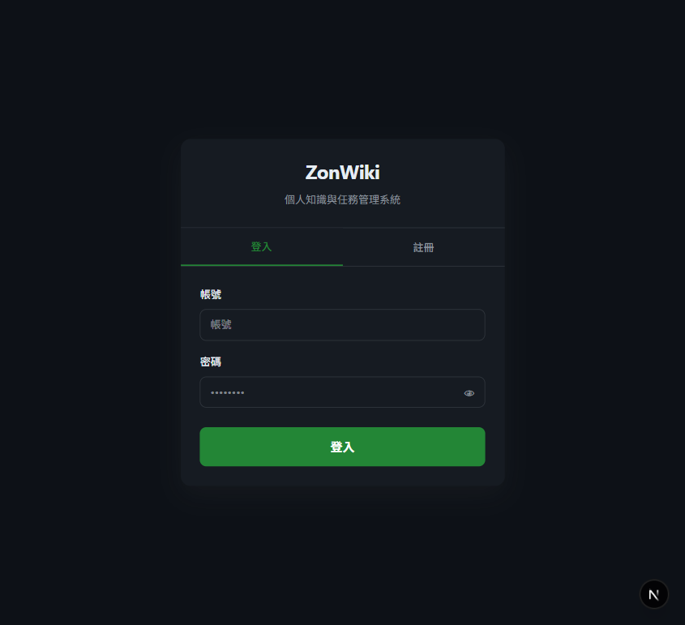
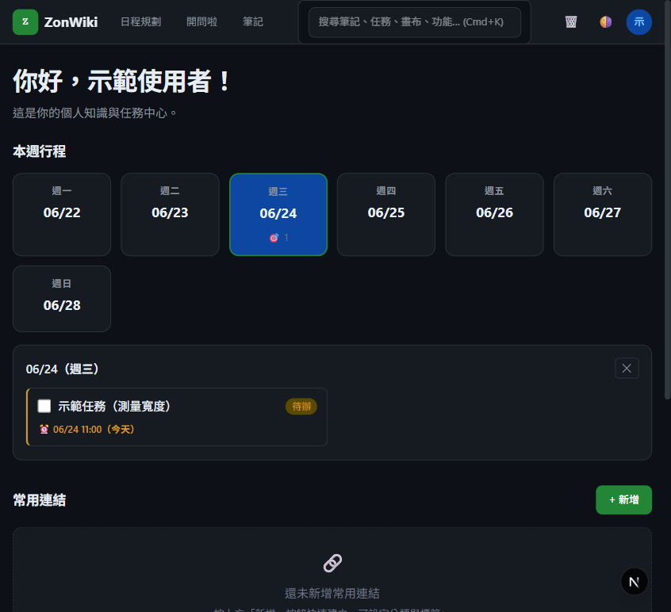
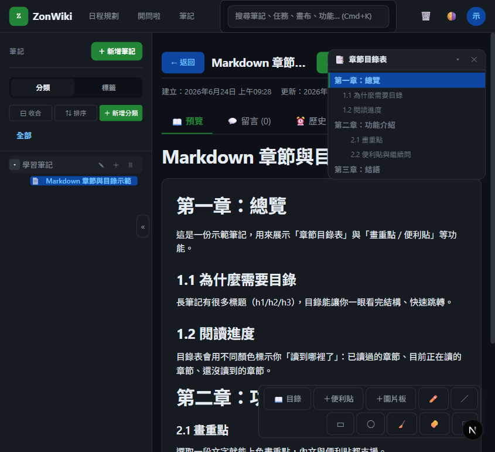
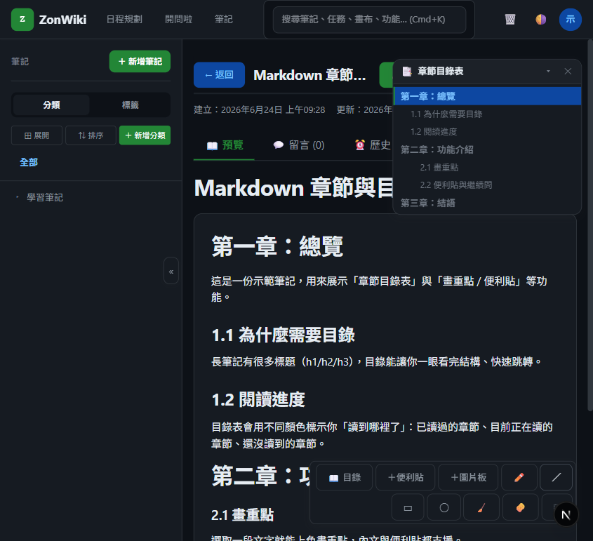
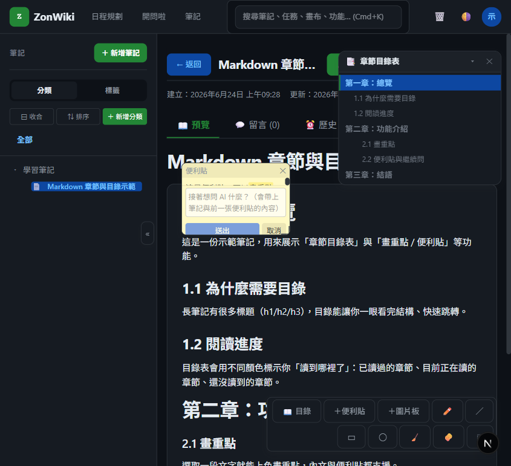
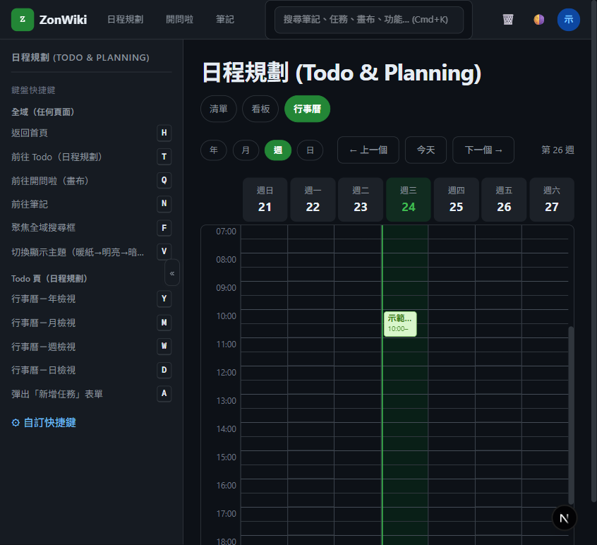
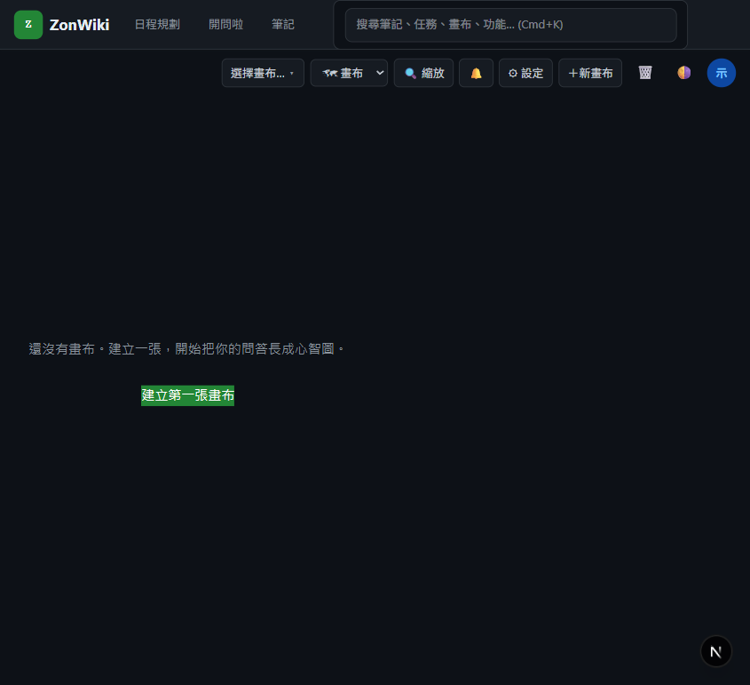
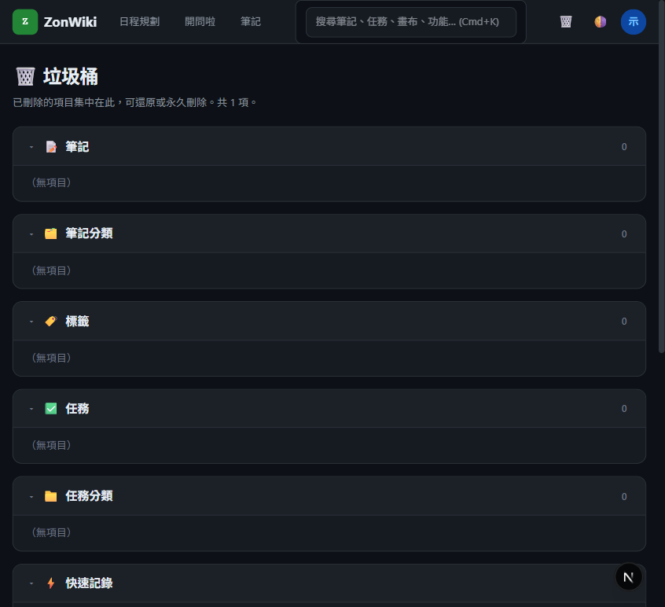
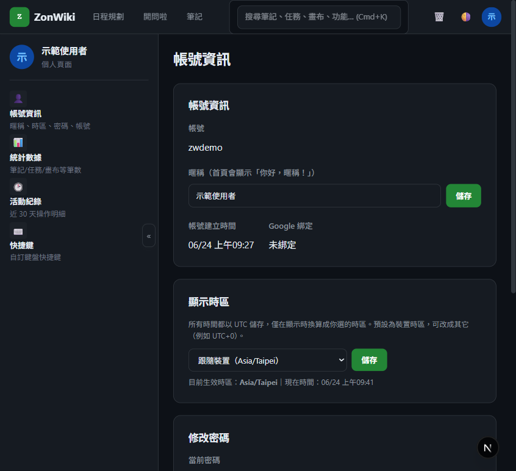

# ZonWiki 使用說明書

> 給「第一次用 ZonWiki」的人：這份文件用**白話＋圖**告訴你每個功能怎麼用、以及**為什麼**要這樣設計
> （為什麼任務要分狀態 / 優先度 / 分類 / 標籤？什麼是父子任務、關聯、反向連結？筆記怎麼畫重點？開問啦怎麼開始？）。
>
> 想自己在本機跑起來，請先看 [README 的「本機啟動」](../readme.md#本機啟動完整步驟)；想讓 AI 助理直接讀寫 ZonWiki，請看 [MCP 使用說明](./MCP使用說明.md)。

---

## 0. ZonWiki 是什麼？

一句話：**把「筆記（知識）」「任務（行動）」「開問啦（AI 畫布）」三件事，收進同一個個人系統**，彼此還能互相關聯。

- **筆記**：用 Markdown 寫，能畫重點、貼便利貼、手繪、做關聯、向 AI 提問。
- **任務**：卡片式待辦，有清單 / 看板 / 行事曆三種視圖，能拆子任務、設關聯。
- **開問啦（Canvas）**：自由畫布，用「節點＋連線」邊畫邊跟 AI 聊。

三者都存進同一個 PostgreSQL 資料庫（**DB 為唯一真相**），所以資料一致、可備份、可被 MCP 程式化存取。

---

## 1. 開始使用：註冊與登入

ZonWiki **不需要 email**——註冊只要「帳號 + 密碼 + 顯示名稱」，密碼至少 8 個字、輸入兩次確認。

登入後就是**首頁**：

首頁有三塊：
- **本週行程**：七天格，預設展開「今日」，點某天可展開看當天任務；打勾完成**不會讓卡片消失**（避免誤觸後忘記）。
- **常用連結**：把常去的網址做成卡片，可分類、貼標籤。
- **快速捕捉（Inbox）**：臨時想法先丟這裡，之後再「分流」成筆記或任務——重點是**先記下來、不打斷思路**。

> 右上角還有：🗑 垃圾桶、🌗 主題切換（暖紙 / 明亮 / 暗色 / 夜間）、帳號選單（個人頁 / 登出）。

---

## 2. 筆記（Notes）

### 2.1 新增與組織：分類像資料夾、標籤像主題

點左側欄「**＋ 新增筆記**」：由上而下填「標題 →（分類、標籤）→ 內容（Markdown）」。

**為什麼同時有「分類」和「標籤」？** 兩者解決不同問題：

| | 分類（Category） | 標籤（Tag） |
|---|---|---|
| 結構 | **樹狀**（資料夾，可有子分類） | **扁平**（一篇可貼很多個） |
| 適合 | 大綱式歸屬，「這篇屬於哪個主題」 | 跨分類的橫向標記，「這篇跟什麼有關」 |
| 例子 | 程式 / 前端 / React | #待複習、#面試、#2026 |

左側欄的「**分類頁**」像 VS Code 的檔案總管：**分類＝資料夾、筆記＝檔案**。點分類前面的三角形可展開／收合，展開後會列出該分類底下的筆記，點筆記即開啟：

> 新增分類用左側欄的「**＋ 新增分類**」鈕；分類可拖曳調整順序或變成子分類（按「⇅ 排序」進入排序模式）。

### 2.2 章節目錄表（長筆記神器）

打開一篇有標題（# / ## / ###）的筆記，右上角會**自動彈出「章節目錄表」**：

- **可自由拖曳**：抓著標題列拖到你喜歡的位置（位置會被記住，每篇筆記各自記）。
- **閱讀進度**：用顏色標示你「讀到哪裡了」——已讀過（綠）、正在讀（高亮）、還沒讀到（淡灰）。
- **點章節跳轉**：點任一章節名稱，頁面平滑捲動到該標題。
- **可關閉、可重開**：按 ✕ 關閉；想重開有兩招——① 右下角工具列的「📖 目錄」鈕；② 重新整理頁面（預設又會打開）。

### 2.3 在內文上標記：畫重點 / 做關聯 / 寫備註 / 框選提問

在「預覽」分頁**選取一段內文**，會浮現工具面板：

- **🖍 畫重點**：選色即套用（完整色盤），重點顏色會存起來。
- **🔗 做關聯**：把這段文字連到**其他筆記 / 任務 / 開問啦節點 / 外部網址**，兩邊都能互點跳轉。
- **📝 寫備註**：為這段文字加註解，滑入即顯示。
- **💬 框選提問**：對選取文字問 AI，會自動生出一張「答案便利貼」貼在旁邊。

> 這些標記都用「文字＋前後文」定位，內容編輯後會自動重新對齊；建立 / 刪除可用 **Ctrl+Z 復原**。

### 2.4 浮層工具：便利貼、手繪、圖片板

預覽時，畫面**右下角有浮動工具列**，可在筆記上疊加：

- **便利貼**：彩色便條，可拖曳 / 縮放 / 改色 / 編輯。便利貼裡也能：
  - **🖍 標重點**：切到標重點模式，選字上色。
  - **💬 繼續問**：以「**筆記內容 ＋ 前一張便利貼 ＋ 本便利貼**」為脈絡繼續問 AI，答案會變成新的便利貼——適合一層層追問。

  

- **手繪塗鴉**：自由筆 / 直線 / 矩形 / 橢圓 ＋ 兩種橡皮擦，可選色、線寬、虛線。
- **圖片板**：放多張圖片、手動上下張切換。

> 便利貼 / 圖片板上的 **✕ 是「刪除」**（不是只關閉）——刪掉的便利貼會進**垃圾桶**，需要時可還原。

### 2.5 匯出 PDF

筆記頁上方「**📄 匯出 PDF**」用瀏覽器原生列印（在列印對話框選「另存為 PDF」即可）。
列印時會自動隱藏全站外殼、右下角工具列與章節目錄表，**只留標題＋內容**；你畫的**手繪塗鴉也會一起印出來**。

### 2.6 AI 兩鍵：調整排版 / 美化內容

編輯筆記時有兩顆 AI 鈕（需要先設定 AI 模型，見 §6）：
- **⚙️ 調整排版**：只統一 Markdown 格式（標題層級、間距、列表…），不改語意。
- **✨ 美化內容**：在保留原意下潤飾措辭與結構。

AI 結果是**預覽**，按「保存」才寫入；不滿意可「↶ 撤銷」。

### 2.7 反向連結與知識圖譜

在筆記內文寫 `[[另一篇筆記標題]]`，那篇筆記就會在它的「**反向連結**」分頁看到這篇——**你不用手動建立**，系統自動偵測。把很多筆記用 Wiki link 串起來，就能在「知識圖譜」子頁看到它們的連接網。

---

## 3. 日程規劃 / 任務（Tasks）

### 3.1 核心概念：一張卡片 = 標題 + 一組屬性

每個任務是一張卡片，屬性決定它怎麼被組織與篩選：

| 屬性 | 為什麼有它 |
|---|---|
| **狀態**（todo / doing / done…） | 表達「進行到哪了」，看板就是依狀態分欄 |
| **優先度**（無 / 低 / 中 / 高） | 表達「多急 / 多重要」，清單可依急迫度排序 |
| **分類 / 標籤** | 與筆記同一套概念：分類＝歸屬、標籤＝橫向標記 |
| **開始 / 截止日期** | 讓任務能落在行事曆上、能算逾期 |
| **內容** | 任務的細節（也是 Markdown） |

> **狀態 vs 優先度常搞混**：狀態是「做到哪了」（流程），優先度是「該先做哪個」（重要 / 緊急）。兩者獨立——一個「高優先度」的任務也可能還在「todo」。

### 3.2 子任務 = 「有父任務的任務」

把大任務拆成小步驟時用子任務。ZonWiki 的設計是：**子任務和一般任務是同一種東西**，只是多了「父任務」關係。所以子任務也有自己的狀態、日期、甚至自己的子任務。在任務編輯器設定「父任務」即可建立父子關係；卡片上會內嵌顯示子任務與進度。

### 3.3 三種視圖：清單 / 看板 / 行事曆

- **清單**：可依建立 / 排程 / 截止日期、分類、急迫度、狀態排序，並可「拆行」分組顯示。
- **看板**：依狀態分欄，拖卡片即改狀態。
- **行事曆**：年 / 月 / 週 / 日。

行事曆的**週 / 日視圖**是「時間格」，任務依實際時間放在對應時段。兩個重點操作：

- **點空白格＝新增該時段任務**：每個任務塊只佔欄寬的一部分，**右側留有空白條**，點它就能在那個時間新增另一個任務（Google Calendar 風）。
- **拖曳 / 縮放**：整塊拖曳可移動時間（週視圖還能橫移到別天）、拖上下緣可改起訖時間，放開即存。

### 3.4 篩選

分類、標籤、時間（全部 / 今天 / 逾期 / 未排程）都能篩選，快速縮小到你關心的任務。

### 3.5 跨模組關聯（任務 ↔ 筆記 ↔ 節點）

在任務編輯器的「**關聯**」區，可以把任務綁到**筆記 / 開問啦節點 / 其他任務**——兩邊都看得到、可互點跳轉。
這讓「任務」旁邊就能掛上它需要的背景知識或設計稿。

> **「關聯」與「反向連結」差在哪？** 關聯是你**手動**把兩個東西綁在一起（任務↔筆記↔節點都行）；反向連結是系統**自動**偵測「哪些筆記用 `[[ ]]` 連到我」。

---

## 4. 開問啦（Canvas，AI 畫布）

開問啦是一塊自由畫布，用「**節點（框框）＋ 連線**」邊畫邊跟 AI 聊。

**怎麼開始？關鍵：要先「建立節點」。** 空白畫布上先新增一個節點，在節點裡打字 / 貼圖；想問 AI 時，在節點內**框選文字 → 提問**，AI 會生出一個「回答節點」並自動連線回來。每個節點可獨立選用不同的 AI 模型。

> 節點內框選文字同樣能：**畫重點、連結到其他節點、框選提問、選取生圖**。畫布、節點也都納入統一垃圾桶，可還原。

---

## 5. 全域搜尋與垃圾桶

- **全域搜尋**（Header 中間，或按 `F`）：一次搜筆記、任務、開問啦節點，關鍵字高亮。
- **統一垃圾桶**（Header 的 🗑）：所有模組的軟刪除集中一處——筆記、分類、標籤、任務、快速記錄、常用連結、**筆記白板（便利貼 / 手繪 / 圖片板）**、開問啦畫布 / 節點。每項可「**↩ 還原**」或「永久刪除」。

---

## 6. 系統設定（個人頁）

點右上角頭像 →「個人頁面」：

- **帳號資訊**：改暱稱、**顯示時區**（全站時間依此換算；資料一律存 UTC）、改密碼、刪帳號。
- **AI 模型管理**：新增你自己的 Claude / Gemini / OpenAI 金鑰（**加密**存於資料庫）。
  - **第一次用 AI 功能（排版 / 美化 / 框選提問 / 節點對話）一定要先在這裡加一個模型**，否則 AI 會無法使用。
  - 也可由維護者用設定檔種一個「全站共用預設模型」（見 [README 的「啟用 AI 功能」](../readme.md#啟用-ai-功能重要--clone-下來自己跑的人必看)）。
- **統計數據 / 活動紀錄 / 快捷鍵**：看用量、看近 30 天操作明細、自訂鍵盤快捷鍵。

---

## 7. 鍵盤快捷鍵（預設）

| 範圍 | 鍵 | 動作 |
|---|---|---|
| 全域 | `H` / `T` / `Q` / `N` | 首頁 / 日程規劃 / 開問啦 / 筆記 |
| 全域 | `F` | 聚焦全域搜尋 |
| 全域 | `V` | 切換主題 |
| Todo 頁 | `Y` / `M` / `W` / `D` | 行事曆 年 / 月 / 週 / 日 |
| Todo 頁 | `A` | 彈出「新增任務」 |

> 都可在「個人頁 → 快捷鍵」重新綁定（跨裝置同步）。打字時不會誤觸。

---

## 8. 給 AI 助理用：MCP

想讓 Claude（Desktop / Code）等 AI 助理**直接讀寫**你的 ZonWiki（列筆記、建任務、開畫布…），ZonWiki 內建了 MCP Server（16 個工具）。設定方式見 **[MCP 使用說明](./MCP使用說明.md)**。

---

## 常見問題

- **Q：一定要設定 AI 嗎？** 不用 AI 功能就不用設；但筆記排版 / 美化、框選提問、開問啦對話需要至少一個 AI 模型（§6）。
- **Q：刪錯了怎麼辦？** 幾乎所有刪除都是「軟刪除」，去 🗑 垃圾桶還原即可。
- **Q：時間怎麼都差幾小時？** 資料一律存 UTC，顯示時依你在「個人頁」設定的時區換算。
- **Q：資料存在哪？** PostgreSQL（DB 為唯一真相）；本機自架見 [README](../readme.md)。

---

_本說明書搭配的截圖以「示範帳號」操作，與你的實際資料無關。_
